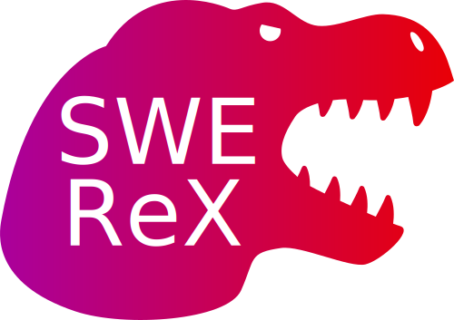

<div align="center">



# SWE-agent Remote Execution Framework

[](https://github.com/SWE-agent/swe-rex/actions/workflows/pytest.yaml)
[](https://github.com/SWE-agent/swe-rex/actions/workflows/check-links.yaml)
[](https://github.com/SWE-agent/swe-rex/actions/workflows/build-docs.yaml)
</div>

## Install

```bash
pip install -e .
# With modal support
pip install -e '.[modal]'
# Development setup (all optional dependencies)
pip install -e '.[dev]'
```
