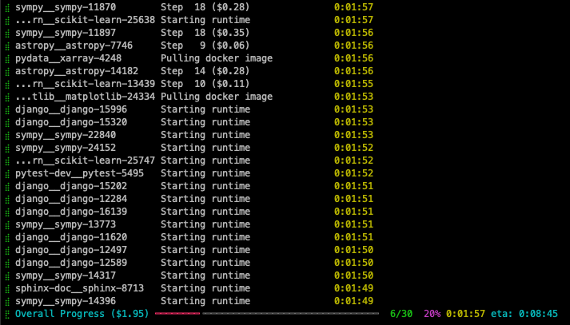

# SWE-ReX

    

SWE-ReX is a runtime interface for interacting with sandboxed shell environments, allowing you to effortlessly let your AI agent run *any command* on *any environment*.

Whether commands are executed locally or remotely in Docker containers, AWS remote machines, Modal, or something else, your agent code remains the same.
Running 100 agents in parallel? No problem either!

Specifically, SWE-ReX allows your agent to

* ✅ **Interact with running shell sessions**. SWE-ReX will recognize when commands are finished, extract the output and exit code and return them to your agent.
* ✅ Let your agent use **interactive command line tools** like `ipython`, `gdb` or more in the shell.
* ✅ Interact with **multiple such shell sessions in parallel**, similar to how humans can have a shell, ipython, gdb, etc. all running at the same time.

We built SWE-ReX to help you focus on developing and evaluating your agent, not on infrastructure.

SWE-ReX came out of our experiences with [SWE-agent][] and [SWE-agent enigma][enigma].
Using SWE-ReX, we

* 🦖 Support **fast, massively parallel** agent runs (which made evaluating on large benchmarks a breeze).
* 🦖 Support a **broad range of platforms**, including non-Linux machines without Docker.
* 🦖 **Disentangle agent logic from infrastructure concerns**, making SWE-agent more stable and easier to maintain.

<figure markdown="span">
{: style="max-width: 500px; border-radius: 10px;"}
<figcaption>SWE-Agent running with SWE-ReX on 30 SWE-bench instances</figcaption>
</figure>

[SWE-agent]: https://swe-agent.com
[enigma]: https://enigma-agent.com