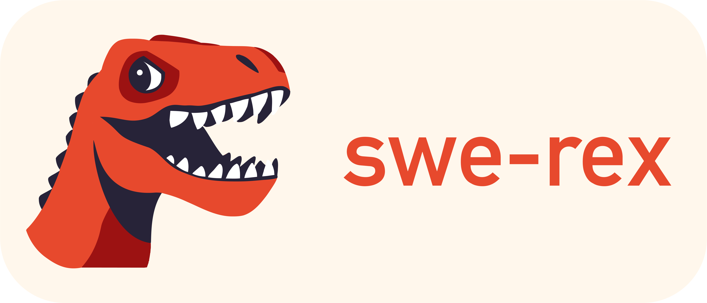

# SWE-ReX

    

SWE-ReX is a runtime interface for interacting with sandboxed shell environments, allowing you to effortlessly let your AI SWE-agent run *any command* on *any environment*.

Whether commands are executed locally or remotely in [Docker](https://www.docker.com/) containers, [AWS remote machines](https://aws.amazon.com/fargate/), [Modal](https://modal.com/), or something else, your SWE-agent code remains the same.

## Why SWE-ReX?

We built SWE-ReX to help you focus on customizing and extending SWE-agent, not on the infrastructure.

In the past several months, a common request in both [SWE-agent](https://github.com/swe-agent/SWE-agent) and open source AI coding agent repositories has been *adapting the codebase to run on different machines and infrastructure*, such as [here](https://github.com/princeton-nlp/SWE-agent/issues/281), [here](), and [here]().

Building support for multiple environments into SWE-agent directly can get messy, particularly when entangled with the core SWE-agent logic. It's a hassle to maintain, and it's hard to keep track of what works where.

So we're separating these two components: SWE-agent focuses on the Agent Computer Interface (ACI) and LM, and SWE-ReX focuses on the infrastructure.

SWE-ReX is a simple interface that allows for running commands on a number of different machines and compute services, including:

* Locally, on your own machine
* [Docker](https://www.docker.com/) containers
* [Modal](https://modal.com/) (Cloud-based AI platform)
* [AWS Fargate](https://aws.amazon.com/fargate/) (a serverless compute engine for containers)
* Remote deployment of your choice

